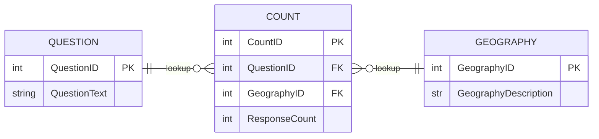

<!--docs\etl\extract\README.md-->


ETL Extract Overview 
====================

'Extract' is the first step in the Extract-Transform-Load (ETL) process.

### Contents

1. Methods
2. Rationale
3. Process 

<br>

-------

Methods 
------- 

1. **Extract Access Databases** — `extract_access` : Reads from a Microsoft Access database. Writes table to sqlite.
2. **Extract Spreasheet Header** — `extract_spreadsheet_head` : Extracts and pivots multi-index header and saves to database table.
3. **Extract Spreadsheet Body** — `extract_spreadsheet_body` : Creates database tables for geographies and counts from given excel workbook.
4. **Extract Spreadsheet Concordance** — `extract_spreadsheet_concordance` : Creates database tables for geographic concordance from given excel workbook.
5. **Extract Geospatial Files** — `extract_geospatial_file` : Reads from a geospatial file. Converts geometries to Well Known Text. Writes table to sqlite. 

<br>

---------

Rationale 
--------- 

Once upon a time, census data was supplied in an Access database. That contained a data model that can be understood as a star schema: 



<br>

Census data has subsequently been supplied in complex spreadsheets. The census data is supplied as pivot tables with multiple lines of headings. 

The aim is to unpivot those wide result tables into long tables as a star schema that can be stored in a database. 

<br>

------- 

Process 
------- 

Complex spreadsheets are extracted with a number of processes: 
```
extract_spreadsheet_head
extract_spreadsheet_body
extract_spreadsheet_concordance
```
<br>

### Source Data Structure

Census spreadsheets may be supplied as pivot tables with multi-index headers: 

---
Regional Council Code, Description | age in broad groups, for the census usually resident population count(1) |
| --- | --- |

| | | Under 15 years | 15–64 Years | 65 years and Over | Total people |
| --- | --- | -------------- | ----------- | ----------------- | ------------ |
| 01 | Northland Region | 35175 | 86253 | 18705 | 140130 |
---

<br>

The multi index table may begin several rows down on the given spreadsheet.  

<br>

### Column Identifiers 

*Materialise column labels as headers:* 

```
| A | B | C | D | ... | 
```

<br>

The content can now be extracted by row or column. 

Many sheets will have over 200 columns. They are reshaped from wide to long tables and stored in the database. 

<br/>

### Questions Table

*Output the multi-index into a standalone table:* 

`tblQuestions` 

--- 
| QuestionCode | QuestionText | QuestionText2 | 
| ------------ | ------------ | ------------- | 
| C | age in broad groups, for the census usually resident population count(1) | Under 15 years | 
| D | age in broad groups, for the census usually resident population count(1) | 15–64 Years |
| E | age in broad groups, for the census usually resident population count(1) | 65 years and Over |
| F | age in broad groups, for the census usually resident population count(1) | Total people |
---

<br/>

### Geographies Table

*Output geographic areas into a standalone table:* 

`tblGeogRegionalCouncil` 

---
| RegionalCouncilCode | RegionalCouncilDescription | 
| ------------------- | -------------------------- | 
| 01 | Northland Region |
---
<br/>

### Counts Table

*Output response counts into a standalone table:* 

`tblCountsRegionalCouncil`

---
| RegionalCouncilCode | QuestionCode | ResponseCount | 
| ------------------- | ------------ | ------------- | 
| 01 | C | 140133 |
| 01 | D | 148470 |
| 01 | E | 151689 |
| 01 | F | 144360 |
---
<br/>

### Data Store

*Store results in a sqlite database*

A SQLite database file collates the extracts from various source datasets for a census.   


....
